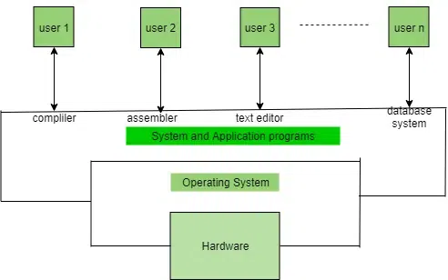
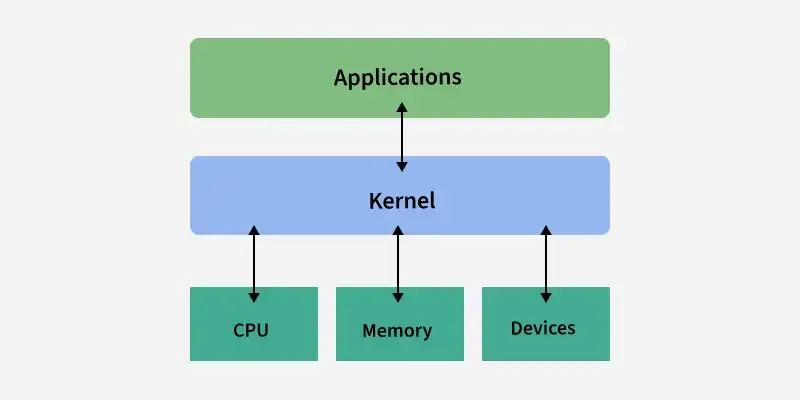
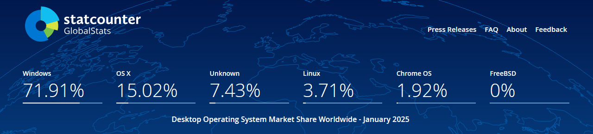

Everybody knows about the two primary operating systems for computers - Windows & MacOS but did you know there exists another operating system that is completely free, open-source and better (imo) than it's counterparts? That's Linux, an awesome operating system (yes nerd, ik it's a kernel hang on 🤓☝️) created by the legendary developer Linus Torvalds who is also the creator of Git! Linux is a community developed project and anyone who is skilled enough to do kernel development can freely contribute to the project.

## What is Linux?

Linux is not really an operating system by itself, it is a kernel. Confused? Don't worry, let me explain - An operating system is basically your main system software that manages everything in your computer from hardware to software.



A kernel is one of the core parts of the operating system that acts like a middle-man between the software and your hardware. For example - let's say you wanted to print a document, first you would use the software like Microsoft Word or Google docs to send a print request to your printer. When you do this, the software sends a request (system call) to your operating system to print said document. This print request is then sent to the kernel which communicates with the printer through the USB interface, printer driver and we finally get our document printed.


As you can see, the kernel behaves as the interface between your applications and your hardware. Now let's get answer the main question - Linux by itself is just the kernel, for a fully functioning operating you need many more utilities on top of it. This is where the GNU utilities come into play, the GNU Software Foundation developed a bunch of utilities such as `ls`,`cp`,`mv`,`mkdir`, etc. which are common utilities that are used by most developers and you might also be familiar with them. So, when we add these GNU utilities (also known as coreutils) to the Linux kernel, we get our "Linux" operating system which is officially known as "GNU/Linux". Most people don't want to say the whole name because let's be honest "Linux" is easier to say so when we say "Linux" we are 99.999% of the times referring to "GNU/Linux".

## But nobody uses Linux right?

Wrong! would you be surprised if I tell you that Linux is the most used operating system in the world? - Android is the most popular operating system and it's based on the Linux kernel, pretty much all the servers in the world running your favorite services such as Facebook, Instagram, Google, etc. use Linux! This is because Linux is extremely reliable for such purposes and is also free to use without the need to pay any company for licenses (unless you buy Red Hat Enterprise Linux).



You could however make the argument that Linux is not popular on the desktop or laptop market and you would be right but Linux is slowly but steadily growing in market share every single year and the nuances surrounding Linux is fading away one by one. Gaming on Linux has gotten better, development on Linux has always been better, hardware support is also improving with companies such as NVIDIA open sourcing some of their driver modules. This growth is also thanks to companies such as Microsoft pushing horrible stuff onto their operating system, Windows has essential becoming a spyware and adware. Microsoft has also imposed artificial hardware limitations such as the requirement of TPM (Trusted Platform Module) which renders most perfectly usable machines unsupported for Windows 11. Meanwhile, Linux can run on a toaster!
![[linux-toaster.webp]]
Oh you thought I was joking? That's a toaster embedded with a Raspberry Pi running the Raspberry Pi OS which is one of the many Linux distributions out there. Linux distributions are like the many types of Linux operating systems and there are lots of them, about ~600 active ones. I would say only few of them matter such as Debian, Arch Linux, Fedora, NixOS, etc. but that's a reddit post debate I don't want to get into.

## Linux taught me more about computers

I installed Ubuntu 16.04 on my Compaq laptop about 9 years ago because it had really bad specs like the Pentium single core processor and 1gb ram which struggled to run Windows 7, to my surprise Ubuntu ran almost perfectly except I didn't know how to do anything on Linux. The terminal scared me and I found it crazy to run a bunch of commands to do basic things as back then we didn't have good GUI applications for even the basic tasks. Fast forward to today and I cannot live without the terminal, GUI applications are a headache to use now - I hate having so much mental overhead as to where this button to do this task is going to be instead I can just use commands such as `ls`, `cp`, `mv`, `mkdir` and `rm` to do whatever I want to do in a few seconds. My developer productivity doubled and I love using the terminal for everything!

Using Linux and such terminal commands really taught me how the operating system functions after all the GUI applications are simply front-ends to these commands it also made me develop a fundamentally different approach to my tasks. Now if I wanted to automate my setups I can just write a simple bash script that does so. For example -

```bash
#!/bin/bash

# Git clone my project
git clone https://github.com/sajayprakash/website

# Change to the website directory
cd website

# Install Hugo
sudo apt install hugo -y

# Run the website server
hugo server

## Visit http://localhost:1313/
```

The above code just allowed you to download and run my website on your local system! Essentially you are telling your operating system to execute these commands one by one and I'm doing so by using a scripting language known as `bash`. So next time, I don't have to remember and type these commands one by one thus automating the setup of my website dev environment. This isn't specific to Linux and can also be done on Windows or MacOS but Linux often forces you to learn some level of terminal stuff which may seem scary at first but is really helpful once you get used to it. I'm just scratching the tip of the iceberg and the possibilities are endless, if you want to learn more there are thousands of videos on YouTube.

Linux also helped me discover the wonderful world of open-source software and also the various communities out there, the Linux fan-base is huge and there are so many wonderful communities out there that are super helpful. People come together form communities to create wonderful open-source software at no cost which is just a wonderful thing that brings humanity closer to each other.

Then there's also window managers which improved my productivity by unimaginable amounts. I can navigate to any workspace, any application, any window with the press of a single keystroke. It's a bit more of an advanced topic and if you don't understand right now don't worry you can google and learn later or watch this video by [ThePrimeagen](https://www.youtube.com/@ThePrimeagen).



## This is not just a hobby but a skill

Linux is not just a hobby, it can be but for many it's also a job! Linux is used everywhere commercially, by learning the fundamentals of Linux you are also developing a skill that you can add to your resume. If you are a developer and you create apps, well the operating system you are going to deploy your database and websites is probably going to be Linux. There are also other jobs that rely on Linux such as system administration, DevOps, cybersecurity, etc. You gain a huge advantage if you really know how to use the the operating system that your stuff will inevitably run on.

## How to start your Linux journey

I don't want to gatekeep Linux and I want as many people as possible to switch to Linux but Linux is not for everyone. If you have certain software preferences such as the Adobe creative suite, you do competitive gaming and play games like Valorant, Fortnite, Apex Legends, etc. such things are not compatible with Linux and sadly might not be supported anytime soon. However, there are alternatives and stuff you can do to get some of these things working and if you're willing to experiment go ahead and give Linux a try. Linux will require you to use the terminal sometime in your journey, it's inevitable and honestly more reliable but if you're not wanting to do all of this, it will be difficult to use Linux as not everything is GUI-ready yet.

Now that you know some of the downsides of Linux, I would recommend beginners to start with something like [Linux Mint](https://www.linuxmint.com/) or [Fedora](https://fedoraproject.org/). Linux mint is a fantastic Linux distribution, it has a GUI for almost everything and is extremely stable, I would recommend you to go with the Cinnamon edition of Linux Mint. For those of you who want a more bleeding-edge system i.e. you have the latest hardware or you want the latest software and updates, want Wayland support then, etc. I would recommend Fedora, it provides a fantastic balance between stability and latest packages, it's what I use(on some of my hardware) and is also used by Linus Torvalds, the creator of Linux! Fedora is not as beginner friendly as Mint but if you want a more advanced distro, go for it!

## Enjoy the journey, not the destination

There will be a few or many hardships you face during your Linux experience, rather than get frustrated learn to google and fix these issues by yourself. Finding and fixing issues by yourself is an essential skill in life and it will teach you how to be self-sustained. You will learn a lot and this will be worth it, after a while you would have learnt everything you need to understand your computer and operating system and after trying out Linux you can form your own opinions and decide for yourself if Linux is for you or maybe you prefer Windows again or if you want a Unix-like experience but more reliable then maybe MacOS is for you, you will only know if you try it.

There's nothing wrong in using other operating systems and unlike what those Linux-elitists say using Windows and MacOS is perfectly fine! I use Windows all the time to game and perform other tasks that are not possible in Linux heck I use Linux within windows most of the time! This can be done by using WSL(Windows Subsystem for Linux) that way I can get the best of both worlds - I game on windows and develop on WSL.
